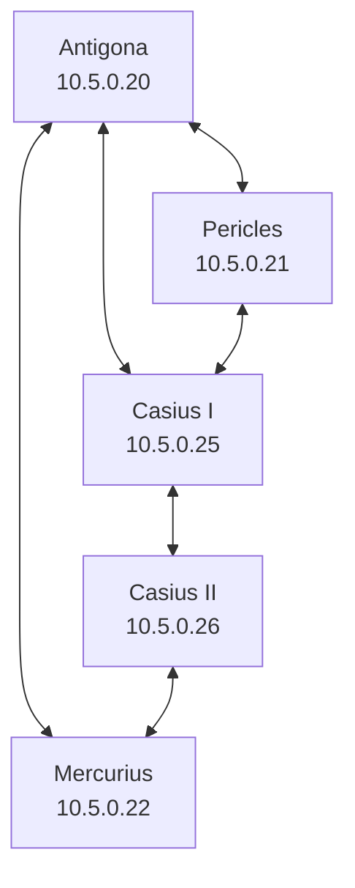

# System graph

```mermaid
graph TD
    A[Antigona\n10.5.0.20]
    M[Mercurius\n10.5.0.22]
    P[Pericles\n10.5.0.21]
    C1[Casius I\n10.5.0.25] 
    C2[Casius II\n10.5.0.26]
    A <--> P
    A <--> M
    A <--> C1
    P <--> C1
    C1 <--> C2
    C2 <--> M
```
